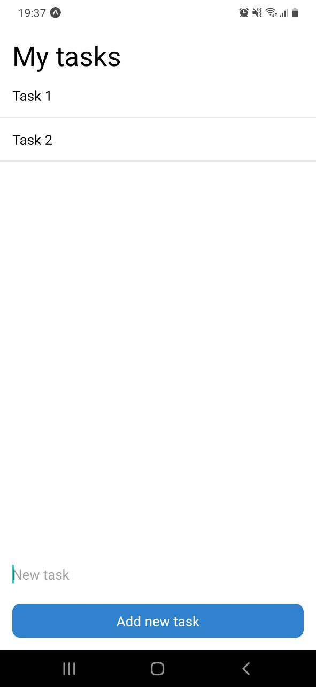

# [noti](https://expo.dev/@malcodeman/noti)

[](https://github.com/malcodeman/noti/master/LICENSE)

Simple react native todo app.



## Getting started

```
git clone https://github.com/malcodeman/noti.git
cd noti
npm install
npm start
```

## License

[MIT](./LICENSE)
